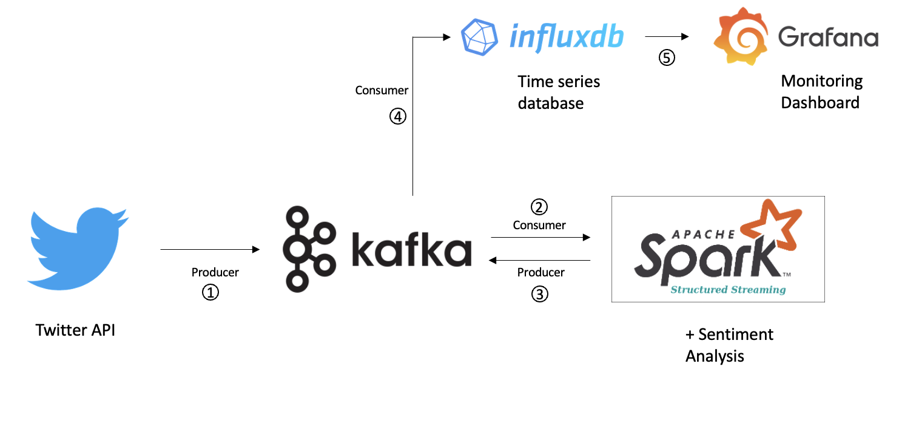
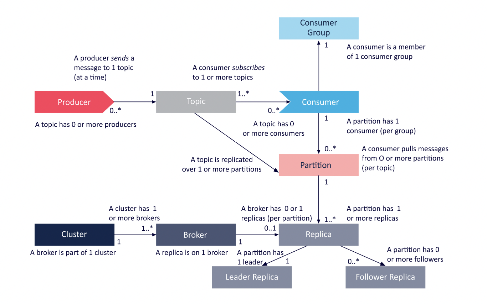

# Twitter Kafka Real-Time Streaming

## Background
It's the time of the year and the NBA playoffs are happening right now. While I was watching the highlights on YouTube, I often find myself scrolling through the comments section. Interestingly, while some rooted for their favourite teams, there were also criticisms on certain players or plays.

This made me wonder if I could gather general sentiments from Twitter in real-time on the games. Therefore, I wanted to build a pipeline to obtain real-time Tweets on #NBA while learning about a few technologies including Kafka and Spark streaming. Here, I managed to build a real-time dashboard using InfluxDB & Grafana, performing a simple sentiment analysis and showing the polarity (positive/negative/neutral) of each tweet over time.

My focus here would be trying out the different technologies and looking at how people react when watching the games. For the sentiment analyses, I took references from other authors as credited below. Although some tweets may not be categorised accurately, it is still pretty interesting to see what people are saying especially during game-time.

## Introduction/ Set up
In this set-up, I am using the following tools:



1. Twitter - tweepy python library
   1. Purpose: to obtain streaming Tweets
   2. Obtain Twitter Developer credentials including consumer key, consumer secret, access token, access token secret
2. Kafka
   1. Kafka is a distributed event streaming platform that lets you read, write, store, and process events (also called records or messages in the documentation) across many machines. 
   <br><br>
   Example events are payment transactions, geolocation updates from mobile phones, shipping orders, sensor measurements from IoT devices or medical equipment, and much more. These events are organized and stored in topics. Very simplified, a topic is similar to a folder in a filesystem, and the events are the files in that folder.
   2. Architecture
   
   3. Purpose: store streaming data while waiting to be processed by producer
   4. Info
      1. Event: an event records the fact that 'something happened'
      2. Topic: a particular stream of data, like a 'table' in a database or 'folder' in filesystem
      3. Producers: client applications writing data to Kafka
      4. Consumers: client applications reading data from Kafka
         1. Consumer offset: Kafka stores offsets at which consumer group has been reading (checkpoint which offset has been read by consumer)
         2. when a consumer dies, it should be able to read off from where it left off
         3. Current offset: current record the consumer reads
         4. Log-end offset: record which has been published by producer to Kafka
         5. Lag: how lag is the consumer reading the Kafka messages (how many more to go?)
      5. Brokers: 
         1. A Kafka cluster is comprised of at least 3 brokers
         2. Each broker contains certain topic partitions - distributed processing
      6. Zookeeper:
         1. manages brokers together
         2. helps in performing leader election for partitions
      7. Delivery Semantics:
         1. At most once: offsets committed as soon as message is received. If processing goes wrong, message will be lost.
         2. At least once: offsets committed after message processed. If processing goes wrong, message can be read again. Can result in duplicate, make sure process is idempotent
         3. Exactly once: can be achieved using Kafka Streams API
   5. Set-up
      1. ``brew install kafka``
      2. Start Zookeeper first
         1. ``bin/zookeeper-server-start.sh config/zookeeper.properties``
      3. Start Kafka Broker service
         1. ``bin/kafka-server-start.sh config/server.properties``
      4. Create topic
         1. ``bin/kafka-topics.sh --create --topic twitterdata --bootstrap-server localhost:9092``
   6. Features/ Items to take note of
      1. **Processing late arriving data/ events**
         1. Documentation: https://aseigneurin.github.io/2018/08/27/kafka-streams-processing-late-events.html
         2. **Terminologies**:
            1. event time: indicates when event happened at the source
            2. processing time: indicates when event is processed by application
         3. Processing time happens after event time for 2 reasons:
            1. can take time for event to reach Kafka broker; event might take time to cache at client before sending out or due to network latency (delay in communication over a network)
            2. the processing engine may not process events as soon as they reach broker
         4. **Solution Ideas:**
            1. discard late event. e.g. if event that should happen in t1 comes in t2, we will ignore this. Aggregation for t1 will be incorrect but for t2 will be correct
            2. wait till end of window; wait till end of t2 to produce result of t1; both t1 and t2 will be correct but at aggregates happen at later time
      2. **Why is Kafka fast?**
         1. Documentation: https://www.geeksforgeeks.org/why-apache-kafka-is-so-fast/
         2. Description: Kafka aims to provide high throughput (large amount of data) and low latency (low delay)
         3. Low-latency I/O - there are two possible reasons which can be used for storing and caching data: ``Random Access Memory (RAM)`` and ``Disk``
            1. Usually, one way to achieve low-latency while delivering messages is to use RAM. It's preferred over disk because **disks have high seek time,** thus making them slower
            2. The downside is that it is expensive to use RAM when data flowing is around 10MB to 500GB per second or more
            3. Thus, Kafka relies on **file system** for storage and caching of messages. Although it uses Disk approach, it still manages to achieve low latency
         4. Reasons:
            1. **Kafka avoids Seek Time** using **Sequential I/O**
               1. It uses a data structure called 'log' which is an append only sequence of events, ordered by time. The log is basically a queue and it can be appended at its end by the producer and the subscribers can process the messages in their own accord by maintaining pointers.
               2. The first record published gets an offset of 0 and the second 1 etc
               3. Data is consumed by consumer by accessing position specified by offset
               4. This also makes Kafka fault-tolerant since stored offsets can be used by other consumers to read new records in case previous consumer fails
            2. **Zero Copy Principle**
               1. When data is fetched from memory and sent over network, it first copies data from Kernel Context into Application Context (from one layer to another)
               2. To send data to internet, it copies data again from Application to Kernel context (back and forth)
               3. This creates a redundant operation, leading to consumption of CPU cycles and memory bandwidth, resulting in drop in performance especially if data are huge
               4. **Zero Copy Principle** doesn't copy data to Application context, it just resides within Kernel and only copies data internally
            3. **Optimal Data Structure**
               1. The tree seems to be the data structure of choice when it comes to data storage. Most of the modern databases use some form of the tree data structure. Eg. MongoDB uses BTree.
                  1. Kafka, on the other hand, is not a database but a messaging system and hence it experiences more read/write operations compared to a database. 
                  2. Using a tree for this may lead to random I/O, eventually resulting in a disk seeks – which is catastrophic in terms of performance.
               2. Thus, it uses a **queue** since all the data is appended at the end and the reads are very simple by the use of pointers. These operations are O(1) thereby confirming the efficiency of the queue data structure for Kafka.
3. Structured Streaming via Pyspark
   1. Documentation: https://spark.apache.org/docs/latest/structured-streaming-programming-guide.html#basic-concepts
   2. Info:
      1. Every data arriving on the stream is like a new row being appended to a table
      2. **Modes**:
         1. Complete - entire updated result table will be written to external storage
         2. Append - only new rows appended in result table since last trigger will be written to external storage. Only used when existing data in external storage won't change
         3. Update - only rows that are updated in result table since last trigger will be written to external storage.
      3. **Types of time window:**
         1. Tumbling window - fixed size, non-overlapping and contiguous time intervals. An input is only bound to one window
         2. Sliding window - similar to tumbling but can overlap if duration of slide is smaller than duration of window. Both tumbling and slide uses ``window`` function
         3. Session window - ``groupBy(session_window(..))``
      4. **Triggers**
         1. default: micro-batches will be generated once previous micro-batch has completed processing
         2. **fixed interval micro-batches**: kicked off at user-specified intervals 
            1. if previous micro-batch completes within the interval, the engine will wait until the interval is over before kicking off the next micro-batch
            2. if the previous micro-batch takes longer, the next micro-batch will start as soon as previous completes
            3. if no new data, no micro-batch will be kicked off
         3. **one-time micro-batch**: execute only one time to process all available data and then stop. This is useful where you want to periodically spin up a cluster, process everything available since last period and then shutdown. This is cost saving
         4. **available-now micro-batch**: similar to one-time, process all available and then stop. Difference is that, it will process data in multiple micro-batches based on the source options, which will result in better query scalability
         5. continuous fixed-time checkpoint interval: low latency, continuous processing mode. (still in experiment)
   3. Set up
      1. ``pip install pyspark``
      2. when running Kafka integration with structured streaming, need to use:
         1. ``spark-submit --packages org.apache.spark:spark-sql-kafka-0-10_2.12:3.2.1`` <consumer_or_producer.py>
   4. **Features/ Items to take note of**
      1. **Handling late data and Watermarking**
         1. ```.groupBy(window(words.timestamp, "10minutes", "5minutes"))``` -> means that we want to aggregate words within each 10 min window, updating every 5 mins -> word counts received between 10 min windows 12:00-12:10, 12:05-12:15, 12:10-12:20 etc
         2. What if an event (event-time 12:04) gets processed at 12:11? - the window aggregate of 12:00-12:10 needs to be updated. To run this query for days, it's required for system to bound the amount of intermediate in-memory state it accumulates, meaning it needs to know when the old aggregate can be dropped from in-memory state because application is not going to receive late data for the aggregation anymore (if not you need large memory to store old aggregates)
         3. **Watermarking** allows engine to track current event time and clean up old data automatically, setting a threshold on how late the data is expected to arrive. Late data will be dropped
         4. ``.withWatermark("timestamp", "10 minutes") \``
      2. **Streaming deduplication**
         1. You can deduplicate records in data streams using a unique identifier in the events. This is exactly same as deduplication on static using a unique identifier column. 
         2. The query will store the necessary amount of data from previous records such that it can filter duplicate records.
         3. Similar to aggregations, you can use deduplication with or without watermarking.
            1. With watermark - If there is an upper bound on how late a duplicate record may arrive, then you can define a watermark on an event time column and deduplicate using both the guid and the event time columns. The query will use the watermark to remove old state data from past records that are not expected to get any duplicates any more. This bounds the amount of the state the query has to maintain.
            2. Without watermark - Since there are no bounds on when a duplicate record may arrive, the query stores the data from all the past records as state.
      3. **Unsupported Operations**
         1. Multiple streaming aggregations
         2. Limit and take the first N rows
         3. Distinct operations
         4. Deduplication operation is not supported after aggregation 
         5. Sorting operations are supported on streaming Datasets only after an aggregation and in Complete Output Mode.
         6. Few types of outer joins
      4. **Recovering failures with Checkpointing**
         1. In case of a failure or intentional shutdown, you can recover the previous progress and state of a previous query, and continue where it left off.
         2. This is done using checkpointing and write-ahead logs.
         3. You can configure a query with a checkpoint location, and the query will save all the progress information (i.e. range of offsets processed in each trigger) and the running aggregates (e.g. word counts in the quick example) to the checkpoint location
         4. This checkpoint location has to be a path in an HDFS compatible file system, and can be set as an option in the DataStreamWriter when starting a query.
         5. ``.option("checkpointLocation", "path/to/HDFS/dir") ``
4. InfluxDB
   1. Purpose: store time-series data (industry standard for time-series) - useful for time dependent sequential data coming at high rate and quick retrieval as time series
   2. Info
      1. Bucket: named location where time series data is stored
      2. Field: key-value pair data structure that stores meta data and actual data value. - not indexed
      3. Measurement: loosely equivalent to concept of table in database. Consists of 3 types of columns - time, tag, fields
      4. Time: track timestamp 
      5. Tag: optional - like categories or usually commonly-queried columns
   3. Set-up
      1. ``Brew install influxdb-cli``
      2. Start Influxdb, localhost:8086, create account, create bucket, org, token
      3. ``create config - influx config create --config <name> --host-url <localhost_port> --org <name> --token <token> --active``

5. Grafana
   1. Purpose: monitor data in real-time, usually for monitoring operational activity/ logs
      1. Set-up
         1. ``brew install grafana``
         2. ``brew services start grafana``
         3. localhost:3000 - create account, set up InfluxDB data source
         4. https://grafana.com/docs/grafana/latest/getting-started/getting-started-influxdb/

## Process
1. Start Kafka Zookeeper service - ``sh kstart_zookeeper.sh``
2. Start Kafka Broker service - ``sh kstart_kafka.sh``
3. Start influxdb - ``sh influxdb.sh``
4. Start Grafana - ``sh grafana.sh``
5. Run ``extract_twitter_to_kafka.py`` - this reads tweets from Twitter and load into Kafka
6. Run ``process_spark_streaming.py`` - reads from Kafka, transform data, performing sentiment analysis and load into another topic in Kafka. Take note of Kafka-Pyspark streaming integration.
7. Run ``load_kafka_to_influxdb.py``
8. Check InfluxDB - http://localhost:8086 - run metrics, take note of query to be used
9. Check Grafana - http://localhost:3000 - build dashboard using queries

## Output


## Future Enhancement
1. Load structured streaming dataframe to InfluxDB directly
2. Improve TextBlob accuracy
3. Include other metrics to visualize more complete analysis
4. Familiarise with InfluxDB / Grafana to fully make use
5. Deploy on Docker with single set-up command
6. Improve reading/writing performance of Structured Streaming to reduce offset lags

## Some commands
- pyspark kafka integration - when running structured streaming: ``spark-submit --packages org.apache.spark:spark-sql-kafka-0-10_2.12:3.2.1 <script.py>``
- delete influxDB data (clean-up) -
  - ``influx delete --bucket <bucket> \
  --start '1970-01-01T00:00:00Z' \
    --stop $(date +"%Y-%m-%dT%H:%M:%SZ")``

## Credits
https://datasciencechalktalk.wordpress.com/2019/07/17/streaming-analysis-with-kafka-influxdb-and-grafana/
https://towardsdatascience.com/twitter-sentiment-analysis-a-tale-of-stream-processing-8fd92e19a6e6
https://blaqfireroundup.wordpress.com/2021/11/01/kafka-and-spark-structured-streaming/